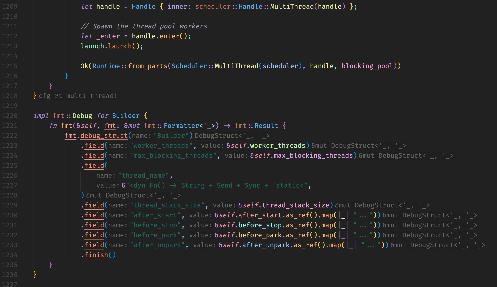

# Syntax highlighting of rust analyzer in VS Code

- [`semantic-highlight-guide`](https://code.visualstudio.com/api/language-extensions/semantic-highlight-guide)
- [`semantic-highlighting-overview`](https://github.com/microsoft/vscode/wiki/Semantic-Highlighting-Overview)
- [`editor-features`](https://rust-analyzer.github.io/manual.html#editor-features)
- `snapshot`

